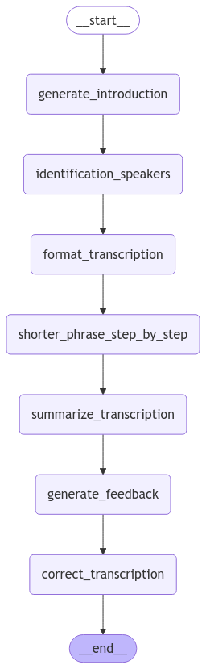

---
# Speech-to-Text & Translation Application

This application provides robust speech-to-text and translation functionalities for both live audio and pre-recorded files. Its key features include:

- **Live Transcription & Translation:** Capture system audio in real time via a loopback device for immediate transcription and translation.
- **File Transcription with Drag & Drop:** Easily transcribe audio files by dragging and dropping them into the interface.
- **Meeting Summaries with LangGraph:** Generate concise summaries from transcriptions (ideal for meetings or lengthy audio recordings) using the LangGraph pipeline.
- **Markdown Viewer & Editor:** Review and edit generated summaries in Markdown format, then export the final output as a DOCX file.
- **Customizable Preferences:** Adjust the transcription and summary behaviors through a modifiable `prompt.json` file that serves as a user template.

---

## Requirements

- **Python 3.11 or higher:**  
  Make sure python 3.11 or more is installed. Type python3 --version. Uninstall any older version using brew uninstall brew uninstall python@3.x then brew cleanup or by removing the python version from the Applications favorite in Finder.
- **Audio Loopback:**  
  For live transcription, your system audio must be routed through a loopback device.  
> **Note:** This feature currently supports macOS users. For testing, the application was configured using **BackHole-2ch**.
- **FFmpeg & PyPandoc:**  
  These are required for audio processing and document conversion.

### Env requirements : 

Create an .env file 
```sh
touch .env
```
Open the newly created .env file. For example on mac, you can type the following command in a terminal
```sh
open -e .env
```

Add these parameters (change the YOUR-HF-TOKEN to your hugging face key that you can create from your hugging face account):
```python
# env
AUDIO_MODEL_NAME="openai/whisper-large-v3-turbo" # wisper for exemple
MODEL_DIR = "./models" # where the models will be download

# Files output directory 
OUTPUT_DIR="./output"

# Only for downloading the Diarization Model with Pyannote 
HF_TOKEN="YOUR-HF-TOKEN"

```
---

## Installation

Before installing and running the application, it is recommended to create a python virtual environment (only the first time).
Replace "python" by "python3" if the "python" command is not found.

```bash
python -m venv env
```
Then activate the environment (each time you'll need to run the application, you'll need to be in this venv)

```bash
source env/bin/activate
```

1. **Install Python dependencies:**  
   ```bash
   pip install -r requirements.txt
   ```
2. **Install FFmpeg,Python Markdown and PyPandoc:**  
   ```bash
   brew install ffmpeg && brew install python-markdown && brew install pypandoc
   ```
If brew was not previously installed on your mac, go to https://brew.sh and type de provided command
   ```bash
   /bin/bash -c "$(curl -fsSL https://raw.githubusercontent.com/Homebrew/install/HEAD/install.sh)"
   ```

---

## Running the Application

Launch the main interface of the application using:
Possibly replace "python" by "python3" if the "python" command is not found.

```bash
python main.py
```

This starts the user-friendly interface where you can select live transcription, live translation, file transcription via drag & drop, and summary generation.

---

## Terminal Commands

The application also supports command-line execution. For example, to run a live transcription instance directly, use:

```bash
ffmpeg -f avfoundation -i ":0" -ac 1 -ar 16000 -f wav - | python3 ./src/live/STT_live.py
```

---

## LangGraph Iteration

The LangGraph module is used to generate summaries from transcribed audio. This pipeline processes the transcription through several steps to produce a concise meeting or audio file summary. The diagram below provides an overview of the LangGraph flow:



---

## Customization with prompt.json

Users can adjust transcription, translation, and summarization preferences by modifying the `prompt.json` file. This allows you to tailor the behavior of the application to your specific needs or template preferences.

---

## Project Architecture

```
Speech2Text/
│── benchmark/                      # Performance test results and benchmarks
│── audiofiles/                     # Sample audio files for testing
│── models/                         # Models (e.g., Whisper, Pyannote)
│── output/                         # Transcription and summary output files
│── pipeline/                       # For open-webui implementation
│── src/
│   │── live/                       # Live transcription module
│   │   │── __init__.py
│   │   │── STT_live.py             # Live transcription logic
│   │
│   │── file/                       # File transcription module
│   │   │── __init__.py
│   │   │── STT_file.py             # File transcription logic 
│   │
│   │── services/                   # Auxiliary services
│   │   │── __init__.py
│   │   │── folder_service.py       # File and directory handling
│   │   │── json_service.py         # JSON file management
│   │   │── LLM_service.py          # Language model services for translation/summarization
│   │   │── Remove_think.py         # Regex module to remove unwanted "think" segments (deepseek integration)
│   │
│   │── core/                       # Core functionality
│   │   │── __init__.py
│   │   │── model_loader.py         # Model loader
│   │   │── transcriber.py          # Transcription logic
│   │
│   │── benchmark/                  # Additional benchmark files
│   │   │── __init__.py
│   │   │── benchmark.py
│   .env                            # add the env values 
│── README.MD
│── Graph_png.png                   # Diagram of LangGraph pipeline
│── requirements.txt
│── main.py                         # Application entry point 
```

---
